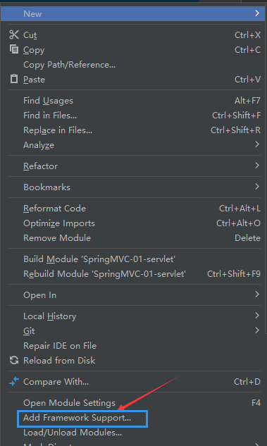
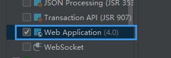
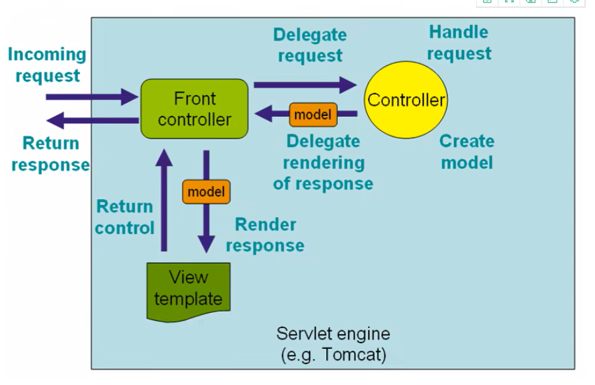
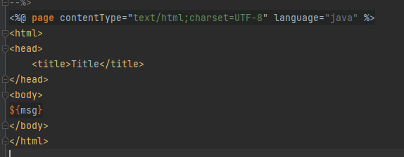
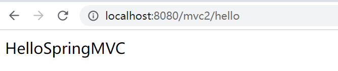
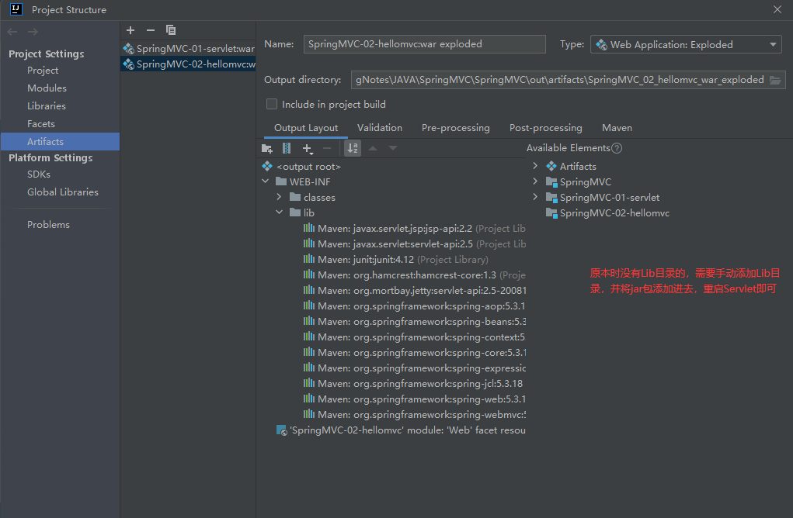
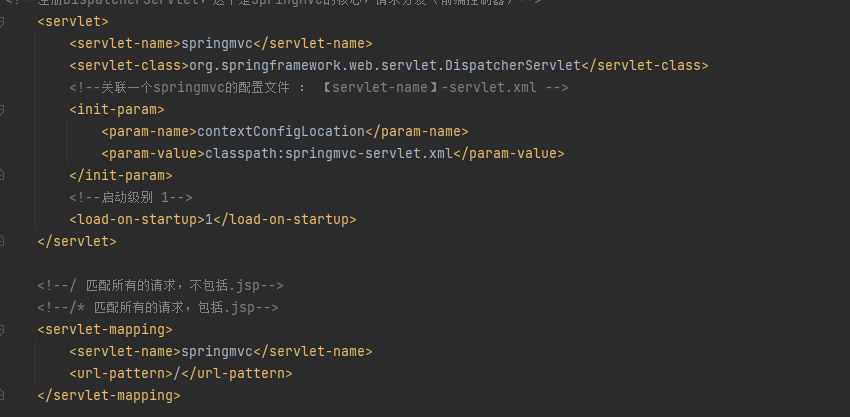
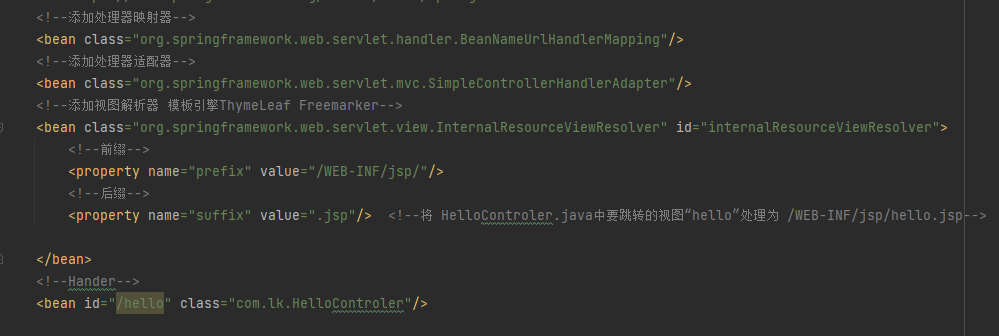
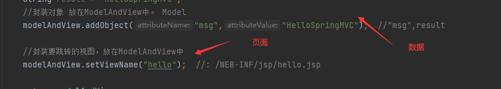

## SpringMVC

### 回顾MVC架构

**MVC**:模型(dao,service) 视图(jsp) 控制器(Servlet)

+ Model(模型)：数据模型，提供要展示得数据，因此包含数据和行为，可以认为是领域模型或JavaBean组件(包括数据和行为)，不够现在一般都分离开来：Value Object(数据Dao)和服务层(行为Service)。也就是模型提供了模型数据查询和模型数据得状态更新等功能，包括数据和业务。
+ View(视图)：复制进行模型得展示，一般就是我们见到得用户界面，客户想看到得东西
+ Controller(控制器)：接收用户请求，委托给模型进行处理（状态改变），处理完毕后把返回的模型数据返回给视图，由视图负责展示，也就是说控制器做了调度员的工作。

最典型的MVC就是JSP+servlet+javabean的模式


> Model1时代

在Web早期开发中，通常采用的都是Model1，Model1中主要分为两层，视图层和模型层


> Model2时代

Model2把一个项目分成三部分，包括**视图、控制、模型**


1、用户发请求

2、Servlet接收请求数据，并调用对应的业务逻辑方法

3、业务处理完毕，返回更新后的数据给servlet

4、servlet转向到JSP，由JSP渲染页面

5、响应给前端更新后的页面

**职责分析**

Controller：取得表单数据，调用业务逻辑，转向指定的页面

Model：业务逻辑，保存数据的状态

View：显示页面


### 回顾Servlet


创建好父项目，导入需要的公共依赖

创建子项目，右键项目名称，添加框架支持






初始一个Servlet项目需要做的一些事情，创建一个继承HttpServlet的类，可以从前端获取参数，可以实现请求/转发，同时编写jsp页面，最后配置注册


MVC框架要做哪些事情：

+ 将url映射到java类或java类的方法
+ 封装用户提交的数据
+ 处理请求 -- 调用相关的业务处理，封装响应数据
+  将响应的数据进行渲染 jsp/html等表示层数据


`常见的服务器端MVC框架`

Structs、 Spring MVC 、ASP.NET MVC 、Zend Framework、 JSF

`常见的前端MVC框架`

Vue、angularjs、react、backbone

由MVC也演化了另外一些模式，如：MVP MVVM等

==MVVM: M+V+VM==

==VM:ViewModel 双向绑定，前后端分离的核心==

`前端人员做后台可能使用 nodejs`

`后端转全栈 TNT？ 后台+前端+数据库+一些运维`

`python 也可做后端`


### 概述

基于Java实现MVC的轻量级Web框架



**sPRINGmvc特点：**

+ 轻量级，易学
+ 高效，基于请求响应的MVC框架
+ 和Spring无缝结合，可以将SpringMVC中所有要用到的bean，直接注册到Spring容器中
+ 约定优于配置
+ 功能丰富：RESTful，数据验证，格式化，本地化


### HelloSpringMVC

+ 新建Module 添加web支持
+ 导入SpringMVC依赖
+ 配置web,xml 注册DipatcherServlet

```xml
<?xml version="1.0" encoding="UTF-8"?>
<web-app xmlns="http://xmlns.jcp.org/xml/ns/javaee"
         xmlns:xsi="http://www.w3.org/2001/XMLSchema-instance"
         xsi:schemaLocation="http://xmlns.jcp.org/xml/ns/javaee http://xmlns.jcp.org/xml/ns/javaee/web-app_4_0.xsd"
         version="4.0">
<!--注册DispatcherServlet-->
    <servlet>
        <servlet-name>springmvc</servlet-name>
        <servlet-class>org.springframework.web.servlet.DispatcherServlet</servlet-class>
        <!--关联一个springmvc的配置文件 ： 【servlet-name】-servlet.xml -->
        <init-param>
            <param-name>contextConfigLocation</param-name>
            <param-value>classpath:springmvc-servlet.xml</param-value>
        </init-param>
        <!--启动级别 1-->
        <load-on-startup>1</load-on-startup>
    </servlet>

    <!--/ 匹配所有的请求，不包括.jsp-->
    <!--/* 匹配所有的请求，包括.jsp-->
    <servlet-mapping>
        <servlet-name>springmvc</servlet-name>
        <url-pattern>/</url-pattern>
    </servlet-mapping>

</web-app>
```


+ 编写SpringMVC配置文件，名称 **springmvc-servlet.xml**

```xml
<?xml version="1.0" encoding="UTF-8"?>
<beans xmlns="http://www.springframework.org/schema/beans"
       xmlns:xsi="http://www.w3.org/2001/XMLSchema-instance"
       xsi:schemaLocation="http://www.springframework.org/schema/beans
        https://www.springframework.org/schema/beans/spring-beans.xsd">
    <!--添加处理映射器-->
    <bean class="org.springframework.web.servlet.handler.BeanNameUrlHandlerMapping"/>
    <!--添加处理器适配器-->
    <bean class="org.springframework.web.servlet.mvc.SimpleControllerHandlerAdapter"/>
    <!--添加视图解析器-->
    <bean class="org.springframework.web.servlet.view.InternalResourceViewResolver" id="internalResourceViewResolver">
        <!--前缀-->
        <property name="prefix" value="/WEB-INF/jsp/"/>
        <!--后缀-->
        <property name="suffix" value=".jsp"/>  <!--将 HelloControler.java中要跳转的视图“hello”处理为 /WEB-INF/jsp/hello.jsp-->

    </bean>
    <!--Hander-->
    <bean id="/hello" class="com.lk.HelloControler"/>


</beans>
```


+ 编写要操作业务的Controller  要么实现Controller接口，要么增加注解，需要返回一个封装了数据和视图的ModelAndView

```java
public class HelloControler implements Controller {
    @Override
    public ModelAndView handleRequest(javax.servlet.http.HttpServletRequest request, javax.servlet.http.HttpServletResponse response) throws Exception {
        //ModelAndView 模型和视图
        ModelAndView modelAndView = new ModelAndView();

        //封装对象 放在ModelAndView中。 Model
        modelAndView.addObject("msg","HelloSpringMVC");

        //封装要跳转的视图，放在ModelAndView中
        modelAndView.setViewName("hello");  //: /WEB-INF/jsp/hello.jsp

        return modelAndView;
    }
}

```

==modelAndView.addObject("msg","HelloSpringMVC");==

控制器中已经设置了jsp页面"msg"的参数，jsp只需传入一个"msg"变量即可，访问/hello页面时直接可以访问到Controller

封装好的参数"HelloSpringMVC",jsp页面如果重新设置"msg"的参数，那么会优先得到jsp页面的参数

+ 编写jsp




+ 访问测试




==可能遇到的问题，访问出现404==

1. 查看控制台输出，看一下是不是缺少了jar包
2. 如果jar包存在，显示无法输出，就在IDEA的项目发布中，添加lib依赖



### SpringMVC执行原理（没理解待补充）

Spring的web框架围绕DispacherServlet设计。DispacherServlet的作用是将请求分发到不同的处理器。从Spring2.5开始，使用java5或者以上版本的，可以用基于注解的controller声明方式


```
DispatcherServlet --> FrameworkServlet --> HttpServletBean --> HttpServlet --> GenericServlet -->
Servlet
```

DispatcherServlet 底层还是实现了 Servlet


**整个显式流程：**

首先 注册了DispatcherServlet，这是SpringMVC的核心，请求分发，也称为前端控制器，



并且关联到 springmvc配置文件，该配置文件中注册实现了 HandlerMapping 、HandlerAdapter和ViewResolver




编写实现Controler接口的Java代码，HandlerMapping映射到HelloControler控制器，返回模型和视图。即数据和页面


