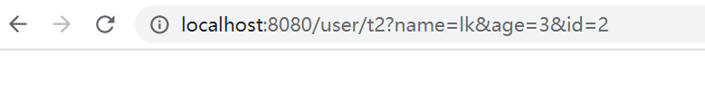

## SpringMVC

### 回顾MVC架构

**MVC**:模型(dao,service) 视图(jsp) 控制器(Servlet)

+ Model(模型)：数据模型，提供要展示得数据，因此包含数据和行为，可以认为是领域模型或JavaBean组件(包括数据和行为)，不够现在一般都分离开来：Value Object(数据Dao)和服务层(行为Service)。也就是模型提供了模型数据查询和模型数据得状态更新等功能，包括数据和业务。
+ View(视图)：复制进行模型得展示，一般就是我们见到得用户界面，客户想看到得东西
+ Controller(控制器)：接收用户请求，委托给模型进行处理（状态改变），处理完毕后把返回的模型数据返回给视图，由视图负责展示，也就是说控制器做了调度员的工作。

最典型的MVC就是JSP+servlet+javabean的模式


> Model1时代

在Web早期开发中，通常采用的都是Model1，Model1中主要分为两层，视图层和模型层


> Model2时代

Model2把一个项目分成三部分，包括**视图、控制、模型**


1、用户发请求

2、Servlet接收请求数据，并调用对应的业务逻辑方法

3、业务处理完毕，返回更新后的数据给servlet

4、servlet转向到JSP，由JSP渲染页面

5、响应给前端更新后的页面

**职责分析**

Controller：取得表单数据，调用业务逻辑，转向指定的页面

Model：业务逻辑，保存数据的状态

View：显示页面


### 回顾Servlet


创建好父项目，导入需要的公共依赖

创建子项目，右键项目名称，添加框架支持


初始一个Servlet项目需要做的一些事情，创建一个继承HttpServlet的类，可以从前端获取参数，可以实现请求/转发，同时编写jsp页面，最后配置注册


MVC框架要做哪些事情：

+ 将url映射到java类或java类的方法
+ 封装用户提交的数据
+ 处理请求 -- 调用相关的业务处理，封装响应数据
+  将响应的数据进行渲染 jsp/html等表示层数据


`常见的服务器端MVC框架`

Structs、 Spring MVC 、ASP.NET MVC 、Zend Framework、 JSF

`常见的前端MVC框架`

Vue、angularjs、react、backbone

由MVC也演化了另外一些模式，如：MVP MVVM等

==MVVM: M+V+VM==

==VM:ViewModel 双向绑定，前后端分离的核心==

`前端人员做后台可能使用 nodejs`

`后端转全栈 TNT？ 后台+前端+数据库+一些运维`

`python 也可做后端`


### 概述

基于Java实现MVC的轻量级Web框架


**sPRINGmvc特点：**

+ 轻量级，易学
+ 高效，基于请求响应的MVC框架
+ 和Spring无缝结合，可以将SpringMVC中所有要用到的bean，直接注册到Spring容器中
+ 约定优于配置
+ 功能丰富：RESTful，数据验证，格式化，本地化


### HelloSpringMVC

+ 新建Module 添加web支持
+ 导入SpringMVC依赖
+ 配置web,xml 注册DipatcherServlet

```xml
<?xml version="1.0" encoding="UTF-8"?>
<web-app xmlns="http://xmlns.jcp.org/xml/ns/javaee"
         xmlns:xsi="http://www.w3.org/2001/XMLSchema-instance"
         xsi:schemaLocation="http://xmlns.jcp.org/xml/ns/javaee http://xmlns.jcp.org/xml/ns/javaee/web-app_4_0.xsd"
         version="4.0">
<!--注册DispatcherServlet-->
    <servlet>
        <servlet-name>springmvc</servlet-name>
        <servlet-class>org.springframework.web.servlet.DispatcherServlet</servlet-class>
        <!--关联一个springmvc的配置文件 ： 【servlet-name】-servlet.xml -->
        <init-param>
            <param-name>contextConfigLocation</param-name>
            <param-value>classpath:springmvc-servlet.xml</param-value>
        </init-param>
        <!--启动级别 1-->
        <load-on-startup>1</load-on-startup>
    </servlet>

    <!--/ 匹配所有的请求，不包括.jsp-->
    <!--/* 匹配所有的请求，包括.jsp-->
    <servlet-mapping>
        <servlet-name>springmvc</servlet-name>
        <url-pattern>/</url-pattern>
    </servlet-mapping>

</web-app>
```


+ 编写SpringMVC配置文件，名称 **springmvc-servlet.xml**

```xml
<?xml version="1.0" encoding="UTF-8"?>
<beans xmlns="http://www.springframework.org/schema/beans"
       xmlns:xsi="http://www.w3.org/2001/XMLSchema-instance"
       xsi:schemaLocation="http://www.springframework.org/schema/beans
        https://www.springframework.org/schema/beans/spring-beans.xsd">
    <!--添加处理映射器-->
    <bean class="org.springframework.web.servlet.handler.BeanNameUrlHandlerMapping"/>
    <!--添加处理器适配器-->
    <bean class="org.springframework.web.servlet.mvc.SimpleControllerHandlerAdapter"/>
    <!--添加视图解析器-->
    <bean class="org.springframework.web.servlet.view.InternalResourceViewResolver" id="internalResourceViewResolver">
        <!--前缀-->
        <property name="prefix" value="/WEB-INF/jsp/"/>
        <!--后缀-->
        <property name="suffix" value=".jsp"/>  <!--将 HelloControler.java中要跳转的视图“hello”处理为 /WEB-INF/jsp/hello.jsp-->

    </bean>
    <!--Hander-->
    <bean id="/hello" class="com.lk.HelloControler"/>


</beans>
```


+ 编写要操作业务的Controller  要么实现Controller接口，要么增加注解，需要返回一个封装了数据和视图的ModelAndView

```java
public class HelloControler implements Controller {
    @Override
    public ModelAndView handleRequest(javax.servlet.http.HttpServletRequest request, javax.servlet.http.HttpServletResponse response) throws Exception {
        //ModelAndView 模型和视图
        ModelAndView modelAndView = new ModelAndView();

        //封装对象 放在ModelAndView中。 Model
        modelAndView.addObject("msg","HelloSpringMVC");

        //封装要跳转的视图，放在ModelAndView中
        modelAndView.setViewName("hello");  //: /WEB-INF/jsp/hello.jsp

        return modelAndView;
    }
}

```

==modelAndView.addObject("msg","HelloSpringMVC");==

控制器中已经设置了jsp页面"msg"的参数，jsp只需传入一个"msg"变量即可，访问/hello页面时直接可以访问到Controller

封装好的参数"HelloSpringMVC",jsp页面如果重新设置"msg"的参数，那么会优先得到jsp页面的参数

+ 编写jsp


+ 访问测试


==可能遇到的问题，访问出现404==

1. 查看控制台输出，看一下是不是缺少了jar包
2. 如果jar包存在，显示无法输出，就在IDEA的项目发布中，添加lib依赖


### SpringMVC执行原理（没理解待补充）

Spring的web框架围绕DispacherServlet设计。DispacherServlet的作用是将请求分发到不同的处理器。从Spring2.5开始，使用java5或者以上版本的，可以用基于注解的controller声明方式


```
DispatcherServlet --> FrameworkServlet --> HttpServletBean --> HttpServlet --> GenericServlet -->
Servlet
```

DispatcherServlet 底层还是实现了 Servlet


**整个显式流程：**

首先 注册了DispatcherServlet，这是SpringMVC的核心，请求分发，也称为前端控制器，


并且关联到 springmvc配置文件，该配置文件中注册实现了 HandlerMapping 、HandlerAdapter和ViewResolver


编写实现Controler接口的Java代码，HandlerMapping映射到HelloControler控制器，返回模型和视图。即数据和页面


### SpringMVC使用注解开发

+ 注册DispatcherServlet，匹配所有请求
+ 编写Springmvc-servlet.xml，和之前不同，这里配置注解开发

```xml
<!--自动扫描包，让指定包下的注解生效，由IOC容器统一管理-->
    <context:component-scan base-package="com.lk.controller"/>

    <!--让Spring MVC不处理静态资源  .css .js .html .mp3 .mp4-->
    <mvc:default-servlet-handler/>

    <!--
    支持mvc注解驱动
        在spring中一般采用@RequestMapping注解来完成映射关系
        要想使@RequestMapping注解生效
        必须向上下文注册DefaultAnnotationHandlerMapping
        和一个AnnotationMethodHandlerAdapter实例
        这两个实例分别在类级别和方法级别处理
        而annotation-driver配置帮助我们自动完成上述两个实例的注入
    -->
    <mvc:annotation-driven/>

    <!--视图解析器-->
    <bean class="org.springframework.web.servlet.view.InternalResourceViewResolver" id="internalResourceViewResolver">
        <!--前缀-->
        <property name="prefix" value="/WEB-INF/jsp/" />
        <property name="suffix" value=".jsp"/>
    </bean>
```


格式基本固定，不用再专门注册 HandlerMapping， HandlerAdapter实例


+ 编写Controler

```java
@Controller
public class HelloControler {
    //localhost:8080/hello/h1  如果不要上面的@RequestMapping注解，则访问的是localhost:8080/h1
@RequestMapping("/h1")
    public String hello(Model model ){

        //封装数据
        model.addAttribute("msg","Hello,SpringMVCannotation");

        return "hello";  //会被视图解析器处理
    }
}

```

### Controler配置总结

控制器，负责提供访问应用程序的的行为，通常通过接口定义或注解定义两种方法实现。

控制器负责解析用户的请求并将其转换为一个模型

在Spring MVC中 一个控制器可以包含多个方法

在Spring MVC中，对于Controller的配置方式有很多种


#### **方式一：实现Controller接口**

```java
//只要实现了Controller 接口的类，说明这就是一个控制器了
public class ControllerTest1 implements Controller {
    @Override
    public ModelAndView handleRequest(HttpServletRequest request, HttpServletResponse response) throws Exception {
        ModelAndView modelAndView = new ModelAndView();

        modelAndView.addObject("msg","ControllerTest1");
        modelAndView.setViewName("test");

        return modelAndView;

    }
}
```


web.xml配置文件不用改变


+ 实现Controller接口 定义控制器是较老的方法
+ 缺点是 一个控制器中只有一个方法，如果要多个方法则需要定义多个Controller。


#### 方式二：使用Controller注解

@Controller 注解类型用于声明Spring类的实例是一个控制器


```java
@Controller  //代表这个类会被Spring接管
public class ControllerTest1  {
    @RequestMapping("/t2")
   public String test1(Model model){
       model.addAttribute("msg","Anotation");

       return "test";  //: /WEB-INF/jsp/test.jsp
   }
}
```


可以写多个方法

```java
@Controller
public class ControllerTest1  {
    @RequestMapping("/t2")
   public String test1(Model model){
       model.addAttribute("msg","Anotation");

       return "test";
   }
    @RequestMapping("/t3")
    public String test2(Model model){
        model.addAttribute("msg","Anotation");

        return "test";
    }
}
```

视图可以被复用


==@RequestMapping说明==

该注解用于映射url到控制器类或一个特定的处理程序方法。可用关于**类或方法上**


用于类上时，表示类中的所有响应请求的方法都是以该地址作为父路径


+ 只在方法上注解


访问路径： http://localhost:8080/项目名/t2

+ 同时注解类与方法


访问路径：http://localhost:8080/项目名/c3/t2

一般不会在类上写注解，哪怕在方法上注解  **"/c3/t2"** ，也是可以的


### RestFul风格

RestFul就是一个资源定位及资源操作的风格。不是标准也不是协议，只是一种风格。基于这个风格设计的软件可以更简洁，更有层次，更易于实现缓存等机制。

**功能**

+ 资源：互联网所有的事物都可以被抽象为资源
+ 资源操作：使用Post、Delete、Put、Get，使用不同方法对资源进行操作
+ 分别对应添加、删除、修改、查询


**传统方式操作资源：**

通过不同的参数来实现不同的效果！方法单一，post 和 get

 http://127.0.0.1/item/queryItem.action?id=1 查询,GET

 http://127.0.0.1/item/saveItem.action 新增,POST

 http://127.0.0.1/item/updateItem.action 更新,POST

 http://127.0.0.1/item/deleteItem.action?id=1 删除,GET或POST


**使用RESTful操作资源** ：可以通过不同的请求方式来实现不同的效果！如下：请求地址一样，但是功能可以不同！

http://127.0.0.1/item/1 查询,GET

 http://127.0.0.1/item 新增,POST

 http://127.0.0.1/item 更新,PUT

 http://127.0.0.1/item/1 删除,DELETE


==测试==

1 新建一个类

```java
@Controller
public class RestFulController {
}

```

2 在Spring MVC中可以使用 @PathVariable 注解，让方法参数的值对应绑定到一个URI模板变量上

```java
@Controller
public class RestFulController {

   //映射访问路径
   @RequestMapping("/commit/{p1}/{p2}")
   public String index(@PathVariable int p1, @PathVariable int p2, Model model){
       
       int result = p1+p2;
       //Spring MVC会自动实例化一个Model对象用于向视图中传值
       model.addAttribute("msg", "结果："+result);
       //返回视图位置
       return "test";
       
  }
   
}

```

3 测试


**使用路径变量的好处？**

+ 路径更加简洁
+ 获得参数更方便，框架会自动进行类型转换
+ 通过路径变量的类型可以约束访问参数，如果类型不一样，则访问不到对应的请求方法，如这里访问的是路径/commit/1/a,则路径与方法不匹配，而不会是参数转换失败


可以通过修改对应参数类型

```java
//映射访问路径
@RequestMapping("/commit/{p1}/{p2}")
public String index(@PathVariable int p1, @PathVariable String p2, Model model){

   String result = p1+p2;
   //Spring MVC会自动实例化一个Model对象用于向视图中传值
   model.addAttribute("msg", "结果："+result);
   //返回视图位置
   return "test";

}
```


**使用method属性指定请求类型**

用于约束请求的类型，可以收窄请求范围，指定请求的类型如 GET,POST,HEAD,OPTIONS,PUT,PATCH,DELETE,TRACE等


```java
//映射访问路径,必须是POST请求
@RequestMapping(value = "/hello",method = {RequestMethod.POST})
public String index2(Model model){
   model.addAttribute("msg", "hello!");
   return "test";
}

```

使用浏览器地址栏进行访问默认是Get请求，报错405


将方法POST 改为GET 就正常了


**小结**

所有的地址栏请求默认都会是HTTP GET 类型的

方法级别的注解变体有如下几个：组合注解

```
@GetMapping
@PostMapping
@PutMapping
@DeleteMapping
@PatchMapping
```

@GetMapping 是一个组合注解，平时使用会比较多

它所扮演的是 @RequestMapping(method =RequestMethod.GET)  的一个快捷方式


### 重定向和转发

**这里不需**要视图解析器，

**转发**


```java
@Controller
public class ModelTest1 {
    @RequestMapping("/m1/t1")
    public String test(Model model){
        //转发
        model.addAttribute("msg","ModelTest1");
        return "forward:/WEB-INF/jsp/test.jsp";
    }
}
```


**重定向**

```java
@Controller
public class ModelTest1 {
    @RequestMapping("/m1/t1")
    public String test(Model model){
        //重定向
        model.addAttribute("msg","ModelTest1");
        return "redirect:/index.jsp";
    }
}
```


配置了视图解析器，就不用转发或是重定向了

```java
@Controller
public class ModelTest1 {
    @RequestMapping("/m1/t1")
    public String test(Model model){

        return "test";
    }
}
```


### 接受请求参数及数据回显


#### 处理提交数据

+ 提交的域名称和处理方法的参数名一致

```java
@Controller
public class ModelTest1 {
    @RequestMapping("/hello")
    public String test(String name){
        System.out.println(name);
        return "test";
    }
}
```


+ 提交的域名称和处理方法的参数名不一致

```java
//@RequestParam("username") :username是提交的域名的参数名
@Controller
public class ModelTest1 {
    @RequestMapping("/hello")
    public String test(@RequestParam("username") String name){
        System.out.println(name);
        return "test";
    }
}
```


+ 提交的是一个对象

要求提交的表单域和对象的属性名一致，参数使用对象即可


**实体类**

```java
@Data
@AllArgsConstructor
@NoArgsConstructor
public class User {
    private int id;
    private String name;
    private int age;
}
```


```java
@Controller
@RequestMapping("/user")
public class UserController {
    @GetMapping("/t1")
    public String test1(@RequestParam("username") String name , Model model){
        // 1、接收前端参数
        System.out.println("接收到的前端参数为" + name);
        //2、将返回的结果传递给前端，Model
        model.addAttribute("msg",name);
        //3、 视图跳转
        return "test";

    }

    //前端接收的是一个对象 ： id name age

    /*
    * 1. 接收前端用户传递的参数，判断参数的名字，假设名字直接在方法上，可以直接使用
    * 2. 假设传递的是一个对象User，匹配User对象中的字段名，如果名字一致就OK，否则，匹配不到
    * */
    @GetMapping("/t2")
    public String test2(User user){
        System.out.println(user);
        return "test";
    }
}
```





如果使用对象的话，前端传递的参数名和对象名必须一致，否则就是Null


#### 数据显示到前端

+ 通过ModelAndView


+ 通过Model


+ 通过ModelMap

```java
    @GetMapping("/t3")
    public String test3(String name,ModelMap map){

        //封装要显示到视图中的数据
        //相当于req.setAttribute("name",name)
        map.addAttribute("name",name);
        System.out.println(name);
        return "test";
    }
```


| Model        | 精简                                                         |
| ------------ | ------------------------------------------------------------ |
| ModelMap     | 继承了LinkedMap，除了实现自身的一些方法，同样继承LinkedMap的方法和特性 |
| ModelAndView | 可以在储存数据的同时，可进行设置返回的逻辑视图，进行控制展示层的跳转 |


#### 乱码问题


先写一个表单做简单测试

```jsp
<form action="/e/t1" method="post">
  <input type="text" name="name">
  <input type="submit">
</form>
```


```java
@Controller
public class EncodingController {
    @PostMapping("/e/t1")
    public String test1(String name, Model model){

        model.addAttribute("msg",name); //获取表单提交的值

        return "test"; //跳转到test页面显示输入的值
    }
}
```


访问表单 通过表单提交数据显示在test.jsp 中


结果乱码（英文和数字不会乱码）


通过设置过滤器 还是乱码

```java
public class EncodingFilter implements Filter {
    @Override
    public void init(FilterConfig filterConfig) throws ServletException {

    }

    @Override
    public void doFilter(ServletRequest servletRequest, ServletResponse servletResponse, FilterChain filterChain) throws IOException, ServletException {
        servletRequest.setCharacterEncoding("utf-8");
        servletResponse.setCharacterEncoding("utf-8");

        filterChain.doFilter(servletRequest,servletResponse);
    }

    @Override
    public void destroy() {

    }
}
```

之后在web.xml中配置注册过滤器


==将Post改为Get方法，通过注册过滤器的方式，不会出现乱码问题==


访问


==通过SpringMVC注册Filter==

```xml
    <!--配置SpringMVC的乱码过滤-->
    <filter>
        <filter-name>encoding</filter-name>
        <filter-class>org.springframework.web.filter.CharacterEncodingFilter</filter-class>
        <init-param>
            <param-name>encoding</param-name>
            <param-value>utf-8</param-value>
        </init-param>
    </filter>
    <filter-mapping>
        <filter-name>encoding</filter-name>
        <url-pattern>/*</url-pattern>
    </filter-mapping>
```


### JSON


前后端分离： 后端部署后端，提供接口，提供数据	； 前端独立部署，负责渲染后端的数据


**JSON** ：是一种轻量级的数据交互格式

+ 采用完全独立于编程语言的文本格式来存储和表示数据

+ 层次结构简洁清晰，有效提升网络传输效率


JavaScript中，一切都是对象，任何JS支持的类型都可以通过JSON来表示：如字符串、数字、对象、数组等


**JSON键值对**是用来保存JS对象的一种方式，和JS对象的写法大同小异，


```json
{"name": "lk"}
{"age": "24"}
{"sex": "男"}
```


==JSON和JavaScript的区别==

+ JSON是JavaScript对象的字符串表示法，它使用文本表示一个JS对象信息，本质是一个字符串

```json
var obj = {a: 'hello' , b : 'world'}; //这是一个对象，键名也可以使用引号包裹
var json = '{"a": "hello", "b": "world"} //这是一个JSON字符串，本质是一个字符串
```


+ JSON和JavaScript对象互转

  + 要实现从JSON字符串转换为JavaScript对象，使用JSON.parse（）方法

    ```
    var obj = JSON.parse('{"a": "Hello","b" :"world"}');
    //结果是 '{"a": "Hello","b": "world"}'
    ```

    

  + 从JavaScript对象转换为JSON字符，使用JSON.stringify( ) 方法

    ```
    var json = JSON.stringify('{"a": "Hello","b": "world"}');
    //结果是 {"a": "Hello","b" :"world"}
    ```

    

    

  ```javascript
  //编写一个JavaScript对象
          var User= {
              name : "lk",
              age : 3,
              sex : "男"
          };
          //将JS对象转换为JSON
          var json = JSON.stringify(User);
  
          console.log(json)
  
          console.log("============")
          //将JSON对象转换为 JavaScript对象
          var obj =JSON.parse(json);
          console.log(obj);
  ```

    


#### JackSon

目前比较好的JSON解析工具

当然还有阿里的fastjson等


+ 第一步 需要导入依赖

```xml
<!-- https://mvnrepository.com/artifact/com.fasterxml.jackson.core/jackson-databind -->
<dependency>
    <groupId>com.fasterxml.jackson.core</groupId>
    <artifactId>jackson-databind</artifactId>
    <version>2.9.8</version>
</dependency>

```


+ 第二步 配置web.xml

```
DispatcherServlet 和 Filter
```


+ 正常方式传入web页面一个User对象参数

```java
@Controller
public class UserController {
    @RequestMapping("/j1")
    @ResponseBody  //加了这个注解，不会走视图解析器，会直接返回一个字符串
    public String json1(){
        //创建一个对象
        User user = new User("lk",23,"男");
        

        return user.toString();
    }
}
```


+ 使用 jackson传参

```java
@Controller
public class UserController {
    @RequestMapping("/j1")
    @ResponseBody  //加了这个注解，不会走视图解析器，会直接返回一个字符串
    public String json1() throws JsonProcessingException {

        //jackson ObjectMapper
        ObjectMapper mapper = new ObjectMapper();
        //创建一个对象
        User user = new User("lk",23,"男");
        String str = mapper.writeValueAsString(user);

        
        return str;
    }
}
```


+ 解决乱码问题1（一般不会这么做）


+ 解决乱码问题2（乱码统一解决）

使用jackson 配置 springmvc-servlet.xml 处理乱码的代码

```xml
 <!--处理乱码问题-->
    <mvc:annotation-driven>
        <mvc:message-converters register-defaults="true">
            <bean class="org.springframework.http.converter.StringHttpMessageConverter">
                <constructor-arg value="UTF-8"/>
            </bean>

            <bean class="org.springframework.http.converter.json.MappingJackson2HttpMessageConverter">
                <property name="objectMapper">
                    <bean class="org.springframework.http.converter.json.Jackson2ObjectMapperFactoryBean">
                        <property name="failOnEmptyBeans" value="false"/>
                    </bean>
                </property>
            </bean>
        </mvc:message-converters>
    </mvc:annotation-driven>
```


==@RestController和@Controller==

@RestController 默认不走视图解析器，返回字符串

@Controller 和 @ResponseBody 搭配使用 可以和 @RestController 一样效果


+ jackson返回一个数组测试

```java
    @RequestMapping("/j2")
    public String json2() throws JsonProcessingException {

        //jackson ObjectMapper
        ObjectMapper mapper = new ObjectMapper();
        List<User> list = new ArrayList<User>();
        //创建一个对象
        User user1 = new User("lk",23,"男");
        User user2 = new User("lk",23,"男");
        User user3 = new User("lk",23,"男");
        User user4 = new User("lk",23,"男");

        list.add(user1);
        list.add(user2);
        list.add(user3);
        list.add(user4);

        String str = mapper.writeValueAsString(list);
        return str;
    }
```


+ 输出时间

```java
    @RequestMapping("/j3")
    public String json3() throws JsonProcessingException {

        //jackson ObjectMapper
        ObjectMapper mapper = new ObjectMapper();
       // 不使用时间戳方式
        mapper.configure(SerializationFeature.WRITE_DATES_AS_TIMESTAMPS,false);

        //自定义日期的格式
        SimpleDateFormat sdf = new SimpleDateFormat("yyyy-MM-dd HH:mm:ss");
        mapper.setDateFormat(sdf);

        Date date = new Date();

        String str = mapper.writeValueAsString(date);
        return str;
    }
```


==将 “ 不使用时间戳 ”写成一个工具类==


```java
public class JsonUtils {

    public static  String getJson(Object object,String dateFormat){
        ObjectMapper mapper = new ObjectMapper();

        //不使用时间戳方式
        mapper.configure(SerializationFeature.WRITE_DATES_AS_TIMESTAMPS,false);
        //自定义日期格式
        SimpleDateFormat sdf = new SimpleDateFormat(dateFormat);
        mapper.setDateFormat(sdf);

        try {
            return mapper.writeValueAsString(object);
        } catch (JsonProcessingException e) {
            e.printStackTrace();
        }
        return null;
    }
}
```


Controller代码

```java
    @RequestMapping("/j3")
    public String json3() throws JsonProcessingException {

        Date date = new Date();
        return JsonUtils.getJson(date,"yyyy-MM-dd HH:mm:ss");
    }
```


工具类中实现代码复用


格式也不用再写了


#### fastjson

```xml
<!-- https://mvnrepository.com/artifact/com.alibaba/fastjson -->
<dependency>
    <groupId>com.alibaba</groupId>
    <artifactId>fastjson</artifactId>
    <version>1.2.60</version>
</dependency>

```

fastJSON 三个主要的类 ：

+ JSONObject 代表json对象

  + JSONObject实现了Map接口，底层操作应该是由Map实现

  + JSONObject对应json对象，通过各种形式的et()方法可以获取json对象中的数据，也可利用诸如size(),isEmpty()等方法获取”键：值“对的个数和判断是否为空

​    

+ JSONArray代表json对象数组
  + 内部有List接口中的方法来完成操作的
+ JSON代表JSONObject和JSONArray的转化
  + JSON类源码分析与使用
  + 这些方法主要是实现json对象  ，对象数组，javabean对象，json字符串之间的相互转化


### SSM整合：Mybatis层

#### 环境搭建

**创建表**

```mysql
CREATE TABLE `books` (
  `bookID` int NOT NULL AUTO_INCREMENT COMMENT '书id',
  `bookName` varchar(100) NOT NULL COMMENT '书名',
  `bookCounts` int NOT NULL COMMENT '数量',
  `detail` varchar(200) NOT NULL COMMENT '描述',
  KEY `bookID` (`bookID`)
) ENGINE=InnoDB DEFAULT CHARSET=utf8mb4

INSERT INTO `books`(`bookID`,`bookName`,`bookCounts`,`detail`)VALUES
(1,'Java',1,'Java带我飞'),
(2,'Mysql',23,'Mysql好好学'),
(3,'Linux',13,'这个也得学');
```


**导入项目依赖**

```xml
    <!--依赖：junit ， 数据库驱动 ， 连接池， servlet , jsp ,mybatis , mybatis-spring,spring-->
    <dependencies>
        <!--Junit-->
        <dependency>
            <groupId>junit</groupId>
            <artifactId>junit</artifactId>
            <version>4.12</version>
        </dependency>
        <!--数据库驱动-->
        <dependency>
            <groupId>mysql</groupId>
            <artifactId>mysql-connector-java</artifactId>
            <version>5.1.47</version>
        </dependency>
        <!-- 数据库连接池 c3p0-->
        <dependency>
            <groupId>com.mchange</groupId>
            <artifactId>c3p0</artifactId>
            <version>0.9.5.2</version>
        </dependency>

        <!--Servlet - JSP -->
        <dependency>
            <groupId>javax.servlet</groupId>
            <artifactId>servlet-api</artifactId>
            <version>2.5</version>
        </dependency>
        <dependency>
            <groupId>javax.servlet.jsp</groupId>
            <artifactId>jsp-api</artifactId>
            <version>2.2</version>
        </dependency>
        <dependency>
            <groupId>javax.servlet</groupId>
            <artifactId>jstl</artifactId>
            <version>1.2</version>
        </dependency>

        <!--Mybatis-->
        <dependency>
            <groupId>org.mybatis</groupId>
            <artifactId>mybatis</artifactId>
            <version>3.5.2</version>
        </dependency>
        <dependency>
            <groupId>org.mybatis</groupId>
            <artifactId>mybatis-spring</artifactId>
            <version>2.0.2</version>
        </dependency>

        <!--Spring-->
        <dependency>
            <groupId>org.springframework</groupId>
            <artifactId>spring-webmvc</artifactId>
            <version>5.1.9.RELEASE</version>
        </dependency>
        <dependency>
            <groupId>org.springframework</groupId>
            <artifactId>spring-jdbc</artifactId>
            <version>5.1.9.RELEASE</version>
        </dependency>

    </dependencies>
```


**静态资源导出问题**

```xml
<!--静态资源导出问题-->
    <build>
        <resources>
            <resource>
                <directory>src/main/java</directory>
                <includes>
                    <include>**/*.properties</include>
                    <include>**/*.xml</include>
                </includes>
                <filtering>false</filtering>
            </resource>
            <resource>
                <directory>src/main/resources</directory>
                <includes>
                    <include>**/*.properties</include>
                    <include>**/*.xml</include>
                </includes>
                <filtering>false</filtering>
            </resource>
        </resources>
    </build>
```


#### **建立基本项目框架**

com.lk.pojo

com.lk.dao

com.lk.service

**resources**:==applicationContext.xml==

```xml
<?xml version="1.0" encoding="UTF-8"?>
<beans xmlns="http://www.springframework.org/schema/beans"
      xmlns:xsi="http://www.w3.org/2001/XMLSchema-instance"
      xsi:schemaLocation="http://www.springframework.org/schema/beans
       http://www.springframework.org/schema/beans/spring-beans.xsd">

</beans>

```

​						==**mybatis-config.xml**==

```xml
<?xml version="1.0" encoding="UTF-8" ?>
<!DOCTYPE configuration
        PUBLIC "-//mybatis.org//DTD Config 3.0//EN"
        "http://mybatis.org/dtd/mybatis-3-config.dtd">
<configuration>

</configuration>

```


#### Mybatis层编写

1、数据库配置文件 **database.properties**

```properties
jdbc.driver=com.mysql.jdbc.Driver
jdbc.url=jdbc:mysql://localhost:3306/ssmbuild?useSSL=false&useUnicode=true
jdbc.username=root
jdbc.password=root
```

2、编写数据库对应的实体类

```xml
 <dependency>
            <groupId>org.projectlombok</groupId>
            <artifactId>lombok</artifactId>
            <version>1.16.10</version>
            <scope>provided</scope>
        </dependency>
```

```java
@Data
@NoArgsConstructor
@AllArgsConstructor
public class Books {
    private int bookID;
    private String bookName;
    private  int bookCount;
    private String detail;
}
```

3、dao编写接口操作

```java
public interface BookMapper {

    //增加一本书
    int addBook(Books books);

    //删除一本书
    int deleteBookByID(int id);
    //查询一本书
    Books queryBookByID(int id);

    //更新一本书
    int updateBook(Books books);
    //查询全部书
    List<Books> queryAllBook();
}
```

4、编写接口对应的Mapper.xml文件

```xml
<?xml version="1.0" encoding="UTF-8" ?>
<!DOCTYPE mapper
        PUBLIC "-//mybatis.org//DTD Config 3.0//EN"
        "http://mybatis.org/dtd/mybatis-3-mapper.dtd">
<mapper namespace="com.lk.dao.BookMapper">

    <insert id="addBook" parameterType="Books">
        insert into ssmbuild.books (bookName, bookCounts, detail)
        values (#{bookName},#{bookCounts},#{detail});
    </insert>

    <delete id="deleteBookByID" parameterType="int">
        delete from ssmbuild.books where bookID = #{bookId};
    </delete>

    <update id="updateBook" parameterType="Books">
        update ssmbuild.books
        set bookName=#{bookName},bookCounts=#{bookCounts},detail=#{detail}
        where bookID = #{bookId};
    </update>

    <select id="queryBookByID" parameterType="Books">
        select * from ssmbuild.books where bookID = #{bookId}
    </select>

    <select id="queryAllBook" parameterType="Books">
        select * from ssmbuild.books
    </select>

</mapper>
```


记得在mybatis-config.xml中注册该Mapper


4、编写Service层的接口和实现类

```java
public interface BookService {
    //增加一本书
    int addBook(Books books);

    //删除一本书
    int deleteBookByID(int id);
    //查询一本书
    Books queryBookByID(int id);

    //更新一本书
    int updateBook(Books books);
    //查询全部书
    List<Books> queryAllBook();
}
```


```java
public class BookServiceImpl implements BookService{
    //Service调dao层 ，组合dao
    private BookMapper bookMapper;

    public void setBookMapper(BookMapper bookMapper) {
        this.bookMapper = bookMapper;
    }

    public int addBook(Books books) {
        return bookMapper.addBook(books);
    }

    public int deleteBookByID(int id) {
        return bookMapper.deleteBookByID(id);
    }

    public Books queryBookByID(int id) {
        return bookMapper.queryBookByID(id);
    }

    public int updateBook(Books books) {
        return bookMapper.updateBook(books);
    }

    public List<Books> queryAllBook() {
        return bookMapper.queryAllBook();
    }
}
```


### SSM整合：Spring层

+ 配置Spring整合MyBatis，

```xml
<?xml version="1.0" encoding="UTF-8"?>
<beans xmlns="http://www.springframework.org/schema/beans"
       xmlns:xsi="http://www.w3.org/2001/XMLSchema-instance"
       xmlns:contex="http://www.springframework.org/schema/context"
       xsi:schemaLocation="http://www.springframework.org/schema/beans
       http://www.springframework.org/schema/beans/spring-beans.xsd">

    <!--1 关联数据库配置文件-->
    <contex:property-placeholder location="classpath:database.properties"/>
    <!--2 连接池-->
    <!--dbcp 半自动化操作
     c3p0 自动化操作(自动化的加载配置文件，可以自动设置到对象中)
     druid
      hikari-->
    <bean id="dataSource" class="com.mchange.v2.c3p0.ComboPooledDataSource">
        <property name="driverClass" value="${jdbc.driver}"/>
        <property name="jdbcUrl" value="${jdbc.url}"/>
        <property name="user" value="${jdbc.username}"/>
        <property name="password" value="${jdbc.password}"/>

        <!-- c3p0连接池的私有属性-->
        <property name="maxPoolSize" value="30"/>
        <property name="minPoolSize" value="10"/>
        <!--关闭连接后不自动commit-->
        <property name="autoCommitOnClose" value="false"/>
        <!--获取连接超时时间-->
        <property name="checkoutTimeout" value="10000"/>
        <!--当前连接失败重试次数-->
        <property name="acquireRetryAttempts" value="2"/>
        

    </bean>

    <!--3 SQLSessionFactory-->

    <bean id="sqlSessionFactory" class="org.mybatis.spring.SqlSessionFactoryBean">
        <property name="dataSource" ref="dataSource"/>
        <!--绑定mybatis的配置文件-->
        <property name="configLocation" value="classpath:mybatis-config.xml"/>
    </bean>

    <!--4 配置Dao接口扫描包，动态的实现了Dao接口可以注入到Spring容器中-->
    <bean class="org.mybatis.spring.mapper.MapperScannerConfigurer">
        <!--注入 sqlSessionFactory-->
        <property name="sqlSessionFactoryBeanName" value="sqlSessionFactory"/>
        <!--要扫描的dao包-->
        <property name="basePackage" value="com.lk.dao"/>
    </bean>
</beans>
```


+ Spring整合service层

```xml
<?xml version="1.0" encoding="UTF-8"?>
<beans xmlns="http://www.springframework.org/schema/beans"
       xmlns:xsi="http://www.w3.org/2001/XMLSchema-instance"
       xmlns:contex="http://www.springframework.org/schema/context"
       xsi:schemaLocation="http://www.springframework.org/schema/beans
       http://www.springframework.org/schema/beans/spring-beans.xsd">

    <!--扫描service下的包-->
    <contex:component-scan base-package="com.lk.service"/>

    <!--2 将我们的所有业务类，注入到Spring，可以通过配置或者注解实现-->
    <bean id="BookServiceImpl" class="com.lk.service.BookServiceImpl">
        <property name="bookMapper" ref="bookMapper"/>
    </bean>

    <!--3 声明式事务配置-->
    <bean id="transactionManager" class="org.springframework.jdbc.datasource.DataSourceTransactionManager">
        <!--注入数据源-->
        <property name="dataSource" ref="dataSource"/>
    </bean>

    <!--4 aop事务支持-->
</beans>
```


### SSM整合：SpringMVC层

1、增加web支持


2、配置web.xml


```xml
<?xml version="1.0" encoding="UTF-8"?>
<web-app xmlns="http://xmlns.jcp.org/xml/ns/javaee"
         xmlns:xsi="http://www.w3.org/2001/XMLSchema-instance"
         xsi:schemaLocation="http://xmlns.jcp.org/xml/ns/javaee http://xmlns.jcp.org/xml/ns/javaee/web-app_4_0.xsd"
         version="4.0">

    <!--DispatchServlet-->
    <!--注册DispatcherServlet-->
    <servlet>
        <servlet-name>springmvc</servlet-name>
        <servlet-class>org.springframework.web.servlet.DispatcherServlet</servlet-class>
        <!--关联一个springmvc的配置文件 ： 【servlet-name】-servlet.xml -->
        <init-param>
            <param-name>contextConfigLocation</param-name>
            <param-value>classpath:spring-mvc.xml</param-value>
        </init-param>
        <!--启动级别 1-->
        <load-on-startup>1</load-on-startup>
    </servlet>

    <!--/ 匹配所有的请求，不包括.jsp-->
    <!--/* 匹配所有的请求，包括.jsp-->
    <servlet-mapping>
        <servlet-name>springmvc</servlet-name>
        <url-pattern>/</url-pattern>
    </servlet-mapping>

    <!--乱码过滤-->
    <filter>
        <filter-name>encodingFilter</filter-name>
        <filter-class>org.springframework.web.filter.CharacterEncodingFilter</filter-class>
        <init-param>
            <param-name>encoding</param-name>
            <param-value>utf-8</param-value>
        </init-param>
    </filter>
    <filter-mapping>
        <filter-name>encodingFilter</filter-name>
        <url-pattern>/*</url-pattern>
    </filter-mapping>

    <!--session-->
    <session-config>
        <session-timeout>15</session-timeout>
    </session-config>
</web-app>
```


3、 spring-mvc.xml

```xml
<?xml version="1.0" encoding="UTF-8"?>
<beans xmlns="http://www.springframework.org/schema/beans"
       xmlns:xsi="http://www.w3.org/2001/XMLSchema-instance"
       xmlns:mvc="http://www.springframework.org/schema/mvc"
       xmlns:context="http://www.springframework.org/schema/context"
       xsi:schemaLocation="http://www.springframework.org/schema/beans
       http://www.springframework.org/schema/beans/spring-beans.xsd
        http://www.springframework.org/schema/mvc
        http://www.springframework.org/schema/mvc/spring-mvc.xsd
        http://www.springframework.org/schema/context
        http://www.springframework.org/schema/context/spring-context.xsd">

    <!--1 注解驱动-->
    <mvc:annotation-driven/>
    <!--2 静态资源过滤-->
    <mvc:default-servlet-handler/>
    <!--3 扫描包-->
    <context:component-scan base-package="com.lk.controller"/>
    <!--4 视图解析器-->
    <bean class="org.springframework.web.servlet.view.InternalResourceViewResolver">
        <property name="prefix" value="/WEB-INF/jsp/"/>
        <property name="suffix" value=".jsp"/>
    </bean>
</beans>
```


4、Spring 配置整合文件，applicationContex.xml

```xml
<?xml version="1.0" encoding="UTF-8"?>
<beans xmlns="http://www.springframework.org/schema/beans"
       xmlns:xsi="http://www.w3.org/2001/XMLSchema-instance"
       xsi:schemaLocation="http://www.springframework.org/schema/beans
       http://www.springframework.org/schema/beans/spring-beans.xsd">

    <import resource="Spring-dao.xml"/>
    <import resource="spring-mvc.xml"/>
    <import resource="Spring-service.xml"/>
</beans>
```

